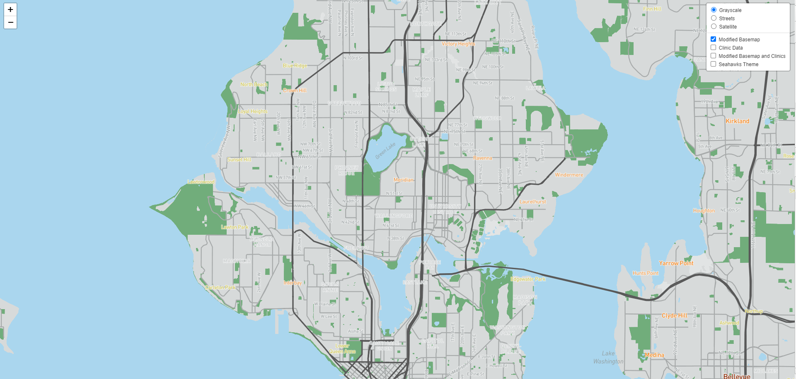
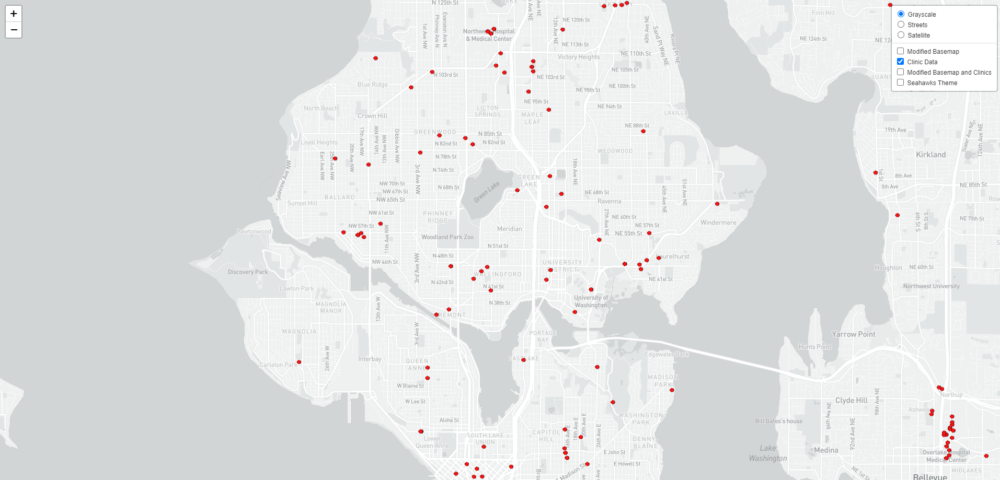
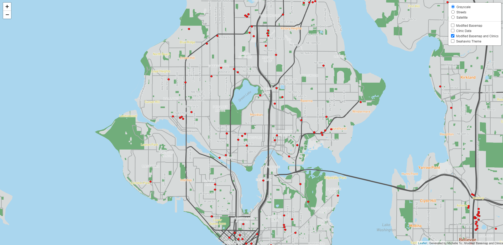
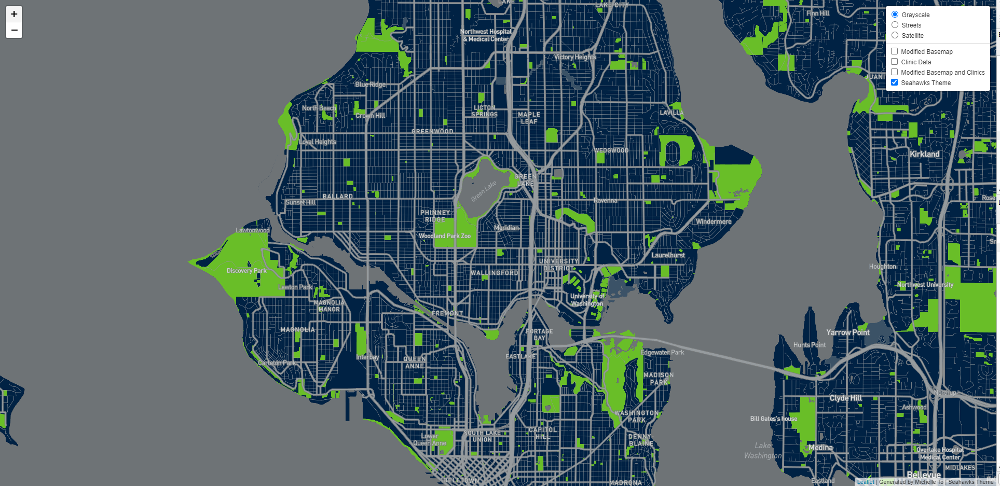

# GEOG458_Lab4 

Lab 4: Generating Map Tiles

Link to hosted webmap: https://yennhito.github.io/lab4geog458/

## Tile 1 Screenshot - Modified Basemap

- Description of Tile: Modified basemap simplified by reducing minor road networks and points of interests. Includes coloring of neighborhoods by density and coloring of waterways and grasslands to allow for ease of viewing.
- Geographic Area of Focus: Seattle, WA and surrounding neighborhoods 
- Zoom Levels: Max Zoom - 14; Min Zoom - 10

## Tile 2 Screenshot - Map Data (Medical Clinics in Seattle)

- Description of Tile: Data layer showing the location of clinics in the Seattle Area.
- Geographic Area of Focus: Seattle, WA and surrounding neighborhoods 
- Zoom Levels: Max Zoom - 14; Min Zoom - 10

## Tile 3 Screenshot - Basemap and Data 

- Description of Tile: Tile utilizing the modified basemap from Tile 1 & the map data from Tile 2
- Geographic Area of Focus: Seattle, WA and surrounding neighborhoods 
- Zoom Levels: Max Zoom - 14; Min Zoom - 10

## Tile 4 Screenshot - Seahawks Theme

- Description of Tile: Map tile made using the color scheme of the Seattle Seahawks. 
- Geographic Area of Focus: Seattle, WA and surrounding neighborhoods 
- Zoom Levels: Max Zoom - 14; Min Zoom - 10